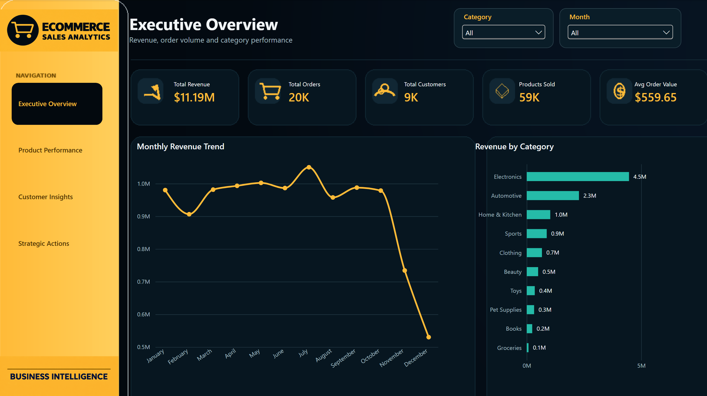
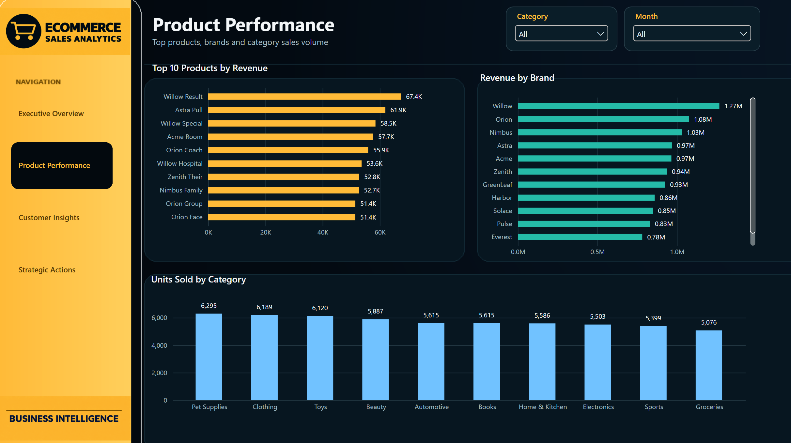
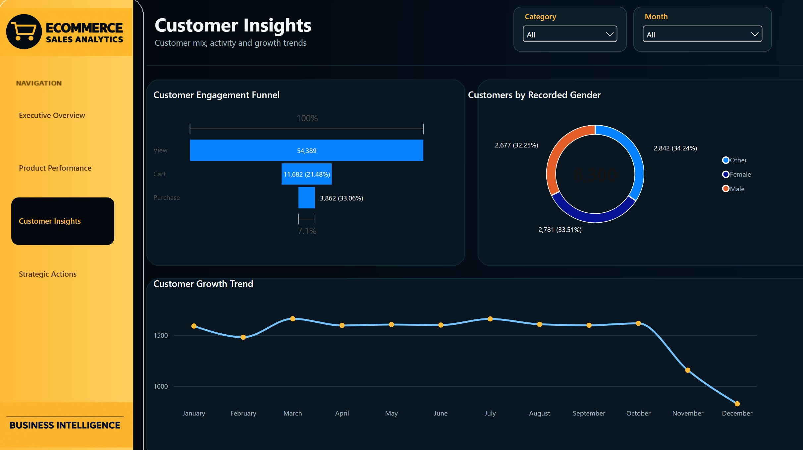
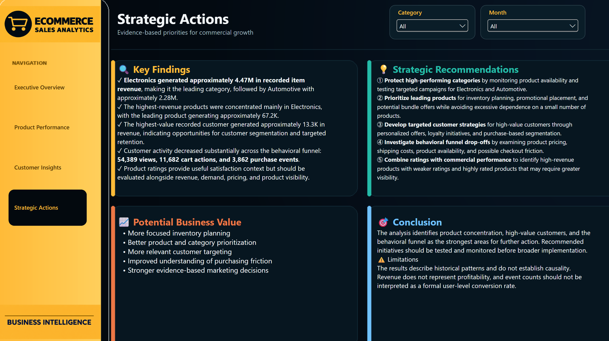

# 📊 E-Commerce Sales Analytics


## 🚀 Project overview

Python • SQL • Power BI • Business Intelligence

This project demonstrates a complete data analytics workflow, transforming raw e-commerce data into actionable business insights through data cleaning, validation, integration, exploratory analysis, SQL analysis, and interactive dashboards.

## Project Workflow

Raw Data → Data Cleaning → Data Validation → Data Integration → Exploratory Data Analysis → SQL Business Analysis → Power BI Dashboard

## Technologies Used

- Python
- Pandas
- NumPy
- SQL
- Power BI
- Jupyter Notebook

## Repository Structure

```text
E-commerce-Sales-Analytics//
├── Notebooks/
├── dashboards/
├── images/
├── data/
├── README.md
├── requirements.txt
└── LICENSE
```

## Dataset

The raw datasets used in this project were obtained from a public Kaggle dataset and include:

- Users
- Products
- Orders
- Order Items
- Reviews
- Events

The data was cleaned, validated, transformed, and integrated into analytical datasets suitable for business intelligence reporting.

## Power BI Dashboard

### Executive Overview
- Total Revenue
- Total Orders
- Total Customers
- Products Sold
- Average Order Value
- Monthly Revenue Trend
- Revenue by Category

### Product Performance Analysis
- Top 10 Products by Revenue
- Revenue by Brand
- Units Sold by Category

### Customer & Engagement Insights

- Customer Engagement Funnel
- Customers by Gender
- Customer Growth Trend

### Executive Insights & Recommendations

- Key findings
- Strategic recommendations
- Potential business value
- Conclusion and limitations

## Key Business Insights

- Electronics is the highest revenue-generating category.
- Automotive is among the strongest-performing categories.
- Revenue remains relatively stable throughout most of the year.
- Customer distribution across genders is balanced.

## Dashboard Preview




---

## Product Performance Analysis



---

## Customer Insights & Engagement Insights



---

## Executive Insights & Recommendations



---

## Skills Demonstrated

- Data Cleaning
- Data Validation
- Data Integration
- Exploratory Data Analysis
- SQL Analytics
- Business Intelligence
- Dashboard Development
- Data Visualization


## Author

### Saad Maher

Data Analyst focused on transforming raw data into clear insights using **Python, SQL, Excel, and Power BI**.

[](https://github.com/Immobre)
[](https://www.linkedin.com/in/saad-m-83b846356/)

*Feel free to explore my other projects and connect with me.*


---

## License

This project is licensed under the MIT License.

